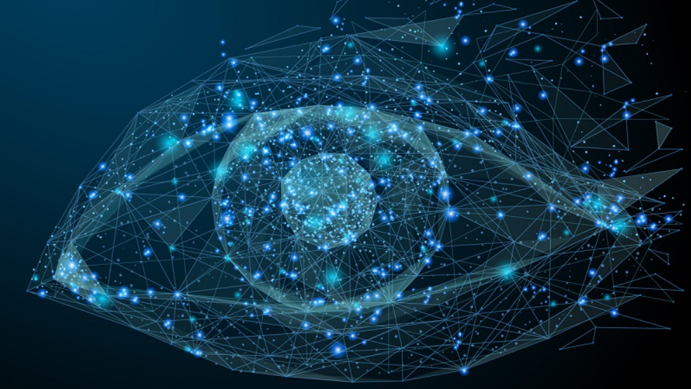
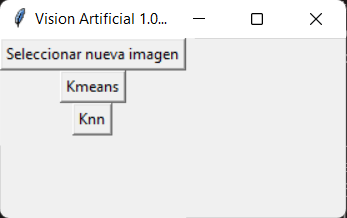
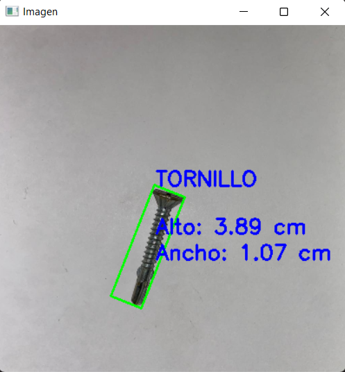
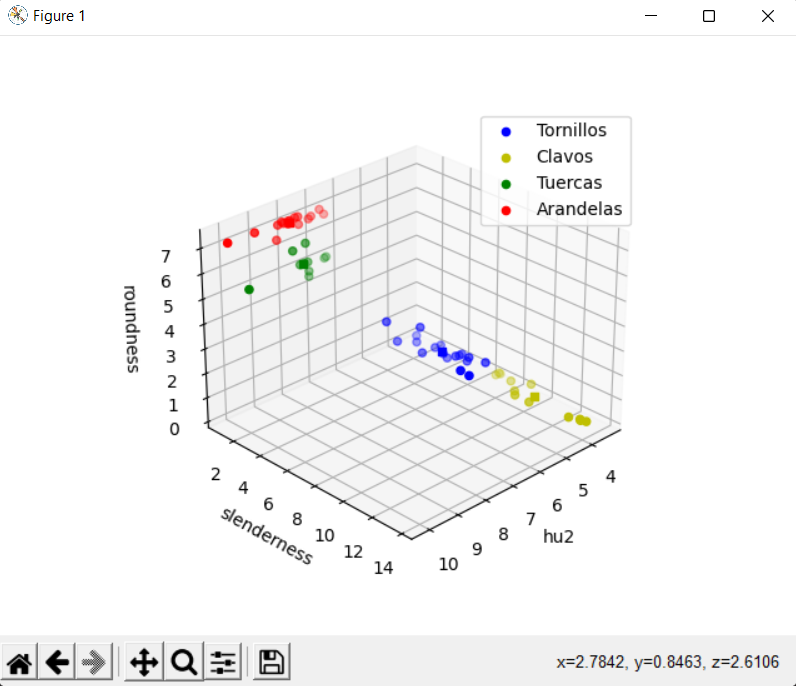

# Computer Vision

Este proyecto consiste en la implementación de un sistema de visión artificial utilizando Python, que permite la identificación y clasificación de diferentes objetos como tuercas, arandelas, clavos y tornillos. La capacidad de distinguir entre estos objetos de manera rápida y precisa es una tarea importante en muchas aplicaciones industriales, y la visión artificial ofrece una solución efectiva.

La visión artificial es una rama de la inteligencia artificial que se enfoca en el desarrollo de algoritmos y técnicas para permitir que las computadoras puedan interpretar y entender las imágenes y videos capturados por cámaras digitales u otros dispositivos similares. Se utiliza en una variedad de aplicaciones, incluyendo el reconocimiento de objetos, la clasificación de imágenes, la detección de defectos y el seguimiento de objetos en tiempo real. La visión artificial utiliza técnicas de procesamiento de imágenes, aprendizaje automático y redes neuronales para analizar y extraer información útil de las imágenes y videos. Su objetivo es permitir que las máquinas puedan "ver" como lo hacen los seres humanos, y así mejorar la precisión y eficiencia de una amplia gama de aplicaciones.

## Recorrido por el programa

Al iniciar veremos una interfaz sencilla que nos permite seleccionar la imagen que deseamos analizar, una vez seleccionada debemos elegir entre uno de dos algorimos, **knn** y **kmeans**, para realizar dicho análisis y determinar si la imagen se trata de una tuerca, un tornillo, una arandela o un clavo.

Una vez seleccionado el algoritmo procedera a mostrarnos el resultado junto con las medidas del objeto seleccionado.

## Funcionamiento del programa

Para el desarrollo del mismo se analizo de manera gráfica diversos parámetros, entre ellos, los **momentos de hu**, la **redondez** y  la **esbeltez.** Estos parámetros se calcularon luego de aplicar diversos filtros a las imágenes, mismo tratamiento que recibe la imágen seleccionada antes de ser analizada. Para la medición se utilizó u

Finalmente se optó por utilizar el segundo momento de hu, la redondez y  la esbeltez. En la siguiente imagen podemos ver la distribución de las imágenes de entrenamiento utilizadas.

### Momentos de Hu

Los momentos de Hu son un conjunto de siete números escalares que se utilizan en la visión artificial para describir la forma y geometría de un objeto. Se calculan a partir de los momentos estadísticos de la imagen binaria del objeto y se utilizan como características para la clasificación de patrones y el reconocimiento de formas. Los momentos de Hu son invariantes a la rotación, la escala y la traslación, lo que significa que son útiles para la identificación de objetos independientemente de su orientación o tamaño en una imagen. Además, los momentos de Hu son robustos y eficientes en términos de cálculo, lo que los hace adecuados para su uso en aplicaciones en tiempo real.

### Esbeltez y redondez

La esbeltez y la redondez son dos medidas geométricas que se utilizan en la visión artificial para caracterizar la forma de un objeto. La esbeltez se refiere a la proporción de la longitud del eje mayor al eje menor de la elipse que mejor se ajusta al objeto, y se define matemáticamente como:

$$
Esbeltez = longitud del eje mayor / longitud del eje menor
$$

La esbeltez es útil para distinguir entre objetos alargados (con esbeltez alta) y objetos más compactos (con esbeltez baja).

La redondez, por otro lado, se refiere a la similitud de un objeto con un círculo perfecto, y se define matemáticamente como:

$$
Redondez = (4 * pi * área) / perímetro^2
$$

La redondez es útil para distinguir entre objetos más redondeados (con redondez alta) y objetos con formas más complejas o angulares (con redondez baja).
